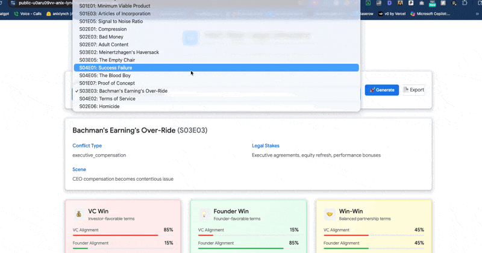

# 🧾 Pied Piper Legal Simulator

**AI-powered VC negotiation simulator inspired by Silicon Valley** • Learn term-sheet dynamics through 19+ scripted scenarios

[](https://public-ndx6vbur4-anix-lynchs-projects.vercel.app)

> **🆕 VC Term-Sheet Advisor (grounded RAG · Gemini on Vertex):** https://pied-piper-advisor-819957310168.us-west1.run.app
> Ask any term → retrieves the matching clause(s) from `data/clauses.json`, links the Silicon
> Valley episode by `conflict_type`, then grounds a **Gemini 2.5 Flash** answer with `[clause_id]`
> citations + founder/VC risk + fund-return direction. DIY retrieval (right-sized for 57 clauses),
> same grounded pattern as the healthcare service. Entrypoint: `main.py` · `advisor.py`.



---

## 🎭 What is This?

An interactive legal simulator that teaches VC & founder negotiation through **Silicon Valley episode scenarios**. For each conflict, see how term-sheet structures could have changed the outcome with **three parallel realities**:

- 💰 **VC Win** – Investors take control (Gavin Belson style)
- 💡 **Founder Win** – Richard keeps power (middle fingers up)
- 🤝 **Win-Win** – Balanced partnership (the unicorn deal)

---

## ✨ Features

### 📺 19 Episode Scenarios
- Board Coup dynamics
- Seed funding negotiations  
- Founder vesting disputes
- IP ownership conflicts
- Liquidation preferences
- And 14+ more real Silicon Valley situations

### 🎯 Dynamic Content
- **Episode-specific narratives** that change based on conflict type
- **Real clauses** from actual term sheets with risk scoring
- **Alignment scores** showing VC/Founder/Balance metrics
- **Legal stakes** explained in plain English (and Silicon Valley humor)

### 🎨 Google/Hooli Design
- Professional Material Design interface
- Clean card-based layout
- Responsive 3-column scenario comparison
- Export to Markdown for analysis

---

## 🚀 Live Demo

**👉 [Try it now](https://public-ndx6vbur4-anix-lynchs-projects.vercel.app)**

---

## 🛠️ Tech Stack

### Frontend
- **React** + **TailwindCSS**
- Google Sans typography
- Material Design components
- Deployed on Vercel

### Backend API
- **FastAPI** (Python)
- **DuckDB** for data persistence
- **Anthropic Claude** for narrative generation (optional)
- Serverless deployment on Vercel

### Data
- 19 curated episode scenarios from Silicon Valley
- 57+ legal clauses with bias tags (VC_bias, Founder_bias, Neutral)
- Conflict-type-specific narrative templates

---

## 📚 What You Learn

### Legal Concepts
- Board composition strategies
- Liquidation preferences (1x, 2x, participating vs. non-participating)
- Anti-dilution provisions (full ratchet vs. weighted average)
- Vesting schedules and acceleration triggers
- IP assignment and licensing structures
- Drag-along and tag-along rights

### Business Strategy
- How VCs structure downside protection
- Why founders fight for board control
- When to accept dilution vs. maintain control
- Trade-offs between runway and autonomy

---

## 🎬 Example: "The Board Coup"

**Episode:** Raviga attempts to replace Richard as CEO

### VC Win Scenario 💰
> "VCs lock down board majority. Founders become employees of their own company. Like when Raviga tried to replace Richard - this is how they do it legally through board composition clauses."

**Clauses:**
- Board Composition: 3/5 seats controlled by investors
- Liquidation Preference: 2x participating preferred
- CEO Removal Rights: Board majority can remove founder

### Founder Win Scenario 💡
> "Founders secure board control with protective provisions. Dual-class shares keep voting power with Richard. This is the 'middle fingers up' moment - founders can't be voted out."

**Clauses:**
- Dual-Class Stock: 10x voting rights for founder shares
- Board Parity: 2-2 split + independent director
- Protective Provisions: Veto on CEO removal

### Win-Win Scenario 🤝
> "Board seats split evenly with independent tie-breaker. Both sides need to agree on major decisions. It's the fantasy scenario where everyone plays nice."

**Clauses:**
- Balanced Board: 3-3 + rotating chair
- Mutual Consent: Major decisions require both sides
- Milestone Triggers: Dilution tied to performance

---

## 🔧 Local Development

```bash
# Clone the repo
git clone https://github.com/anix-lynch/pied-piper-legal-simulator.git
cd pied-piper-legal-simulator

# Backend API
python -m venv venv
source venv/bin/activate  # or `venv\Scripts\activate` on Windows
pip install -r requirements.txt
python app.py

# Frontend (open in browser)
# Just open frontend/index.html in your browser
# Or serve with: python -m http.server 3000
```

---

## 📊 Data Structure

### Episodes (`data/episodes.json`)
```json
{
  "episode_id": "S02E04",
  "title": "The Board Coup",
  "conflict_type": "board_control",
  "scene": "Raviga attempts to replace Richard as CEO",
  "founder_action": "Richard negotiates to maintain control",
  "vc_action": "Laurie pushes for majority board seats",
  "result": "Power struggle over company direction",
  "legal_stakes": "Board composition, CEO removal rights, voting control"
}
```

### Clauses (`data/clauses.json`)
```json
{
  "clause_id": "BC01",
  "conflict_type": "board_control",
  "bias": "VC_bias",
  "clause_type": "Board Composition",
  "short_text": "Investor-controlled board with 3/5 seats",
  "explanation": "VCs gain majority control and can remove CEO",
  "risk_score_founder": 95,
  "risk_score_vc": 5
}
```

---

## 🎓 Use Cases

- **Law students** learning venture capital documentation
- **Founders** preparing for term-sheet negotiations
- **VCs** explaining deal structures to portfolio companies
- **Business schools** teaching startup financing
- **Anyone** who loves Silicon Valley and wants to understand the legal drama

---

## 🌟 About

Built by [Anix Lynch](https://gozeroshot.dev) as part of a portfolio of AI-powered business intelligence tools.

**Other Projects:**
- [Financial Modeling Automation](https://huggingface.co/spaces/anixlynch/financial-modeling-automation)
- [Multimodal GenAI Studio](https://gozeroshot.dev)
- [AI Business Intelligence Agent](https://gozeroshot.dev)

---

## 📝 License

MIT License - Feel free to use this for educational purposes!

---

## 🤝 Contributing

Want to add more episodes or improve the legal accuracy? PRs welcome!

1. Fork the repo
2. Add your episode to `data/episodes.json`
3. Add corresponding clauses to `data/clauses.json`
4. Update conflict-type narratives in `api/index.py`
5. Submit a PR

---

## ⚖️ Legal Disclaimer

This is an **educational tool** inspired by the TV show Silicon Valley. It is not legal advice. Always consult with a qualified attorney for actual term-sheet negotiations.

---

**Made with 💙 for the Silicon Valley community**

*"This guy f***s!" - Russ Hanneman (probably about this simulator)*

